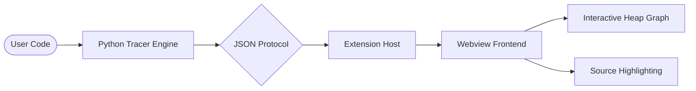

# 🐍 Python Execution Visualizer

  

  <b>A professional-grade VS Code extension to visualize Python execution step-by-step—like Python Tutor, right inside your editor.</b>

  
  
  
  

---

## 📺 Project Demo

Experience the full power of the visualizer. See how it handles complex data structures, recursion, and real-time state changes.

> [!TIP]
> Click the link below to watch the video demonstration.

[**🎬 Watch the Python Visualizer Demo**](media/Python_Visulaizer_Demo.mp4)

---

## ✨ Amazing Features

| Feature | Description |
| :--- | :--- |
| **🐍 Live Tracing** | Watch your code execute line-by-line with high precision. |
| **📦 Heap Visualization** | Interactive SVG graph showcasing objects, types, and references. |
| **🗂️ Call Stack** | Deep-dive into active frames and local variable snapshots. |
| **🟢 Mutation Alerts** | Variables that changed since the last step are highlighted for clarity. |
| **⏱️ Time-Travel** | Scrub through the entire execution timeline seamlessly. |
| **🎨 Sleek UI** | A premium, theme-aware interface that feels like part of VS Code. |

---

## 🚀 Getting Started

### Prerequisites

- **Python 3.8+** must be installed and added to your `PATH`.
- **VS Code 1.85+** for the best experience.

### How to Use

1.  **Open** any `.py` file you wish to visualize.
2.  **Launch** the visualizer using one of these methods:
    *   Click the **▶ (Visualizer Icon)** in the top-right Editor Title Bar.
    *   Right-click in the editor and select **Python Visualizer: Visualize Execution**.
    *   Command Palette (`Ctrl+Shift+P` / `Cmd+Shift+P`) ➜ type **"Python Visualizer"**.

---

## ⌨️ Productivity Shortcuts

Master the visualizer with these intuitive keyboard controls:

| Key | Action |
| :--- | :--- |
| `Space` | **Run / Pause** (Auto-advance every 500ms) |
| `→` | **Next Step** |
| `←` | **Previous Step** |
| `Home` | **Restart** (Jump to Step 1) |
| `End` | **Finish** (Jump to Last Step) |

---

## ⚙️ Customization

Tailor the extension to your needs via **VS Code Settings** (`Ctrl+,`):

*   `pythonVisualizer.pythonPath`: Specify a custom path to your Python interpreter.
*   `pythonVisualizer.autoPlayInterval`: Adjust the speed of the "Run" mode (in ms).
*   `pythonVisualizer.maxSteps`: Set the maximum number of steps to capture (default: 5000).

---

## 🏗️ Architecture Under the Hood

The extension utilizes a robust `sys.settrace` engine to capture the heartbeat of your Python code.

---

## 📜 License

Distributed under the **MIT License**. See `LICENSE` for more information.

---

  <i>"Debugging is twice as hard as writing the code in the first place. Therefore, if you write the code as cleverly as possible, you are, by definition, not smart enough to debug it."</i> — Brian Kernighan

  <b>Build smarter with Python Visualizer.</b>

