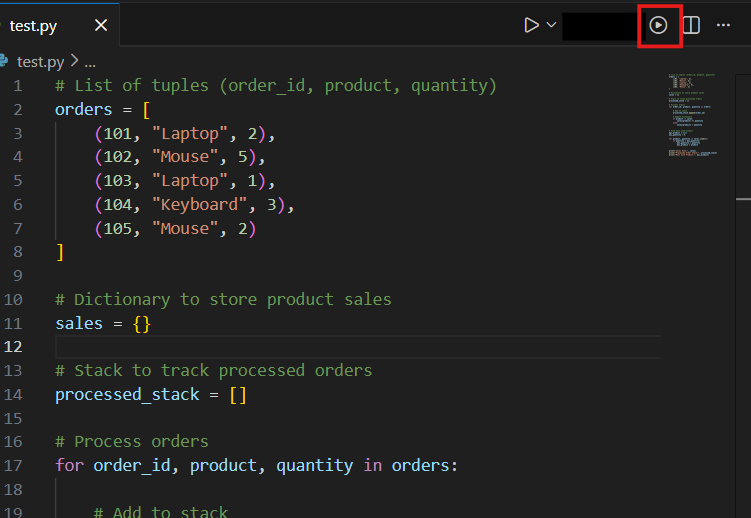
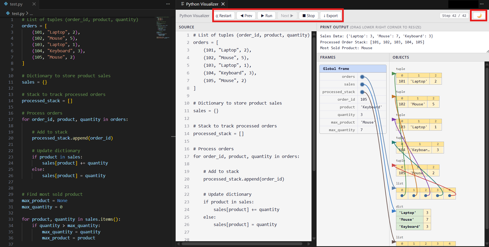

# 🐍 Python Execution Visualizer

  

  <h2 align="center">See Your Code. Understand Your Logic.</h2>
  

    <b>A high-performance VS Code extension that turns Python execution into an interactive visual experience. Perfect for students, educators, and developers debugging complex algorithms.</b>
  

  
  
  

---

## 📺 Experience the Magic

Stop guessing what happens in the heap. Watch your code come to life in real-time.

**[🎬 Click Here to Watch the Full Video Tutorial/Demo](https://drive.google.com/file/d/1OLWkz2cLU3e5YkSTrWGRhuRdQSxGxdKJ/view?usp=drive_link)**

---

## 🎯 Why Python Visualizer?

Standard debuggers show you values in a tree. **Python Visualizer** shows you the *connections*.

| Feature | 🐍 Python Visualizer | 🪟 Standard Debugger |
| :--- | :---: | :---: |
| **Heap Memory Mapping** | ✅ Visual Linkages | ❌ Plain Values |
| **Object Mutations** | ✅ Auto-Highlighted | ❌ Manual Check |
| **Time-Travel** | ✅ Instant Scrubbing | ⚠️ Single Step Only |
| **Nested Structures** | ✅ Interactive Graphs | ⚠️ Click-to-Expand |
| **Education Focused** | ✅ High | ❌ Low |

---

## ✨ Power-User Features

| Feature | Visual Icon | What it does |
| :--- | :---: | :--- |
| **Live Tracing** | ⚡ | Captures every frame, local variable, and heap object. |
| **Interactive Heap** | 🕸️ | Drag, zoom, and pan through a dynamic object graph. |
| **Smart Diffing** | 🟢 | Automatically highlights variables that modified their state. |
| **Stack Inspection** | 🗂️ | Visualize recursion with a clear, numbered call stack. |
| **Theme Sync** | 🌓 | Instantly adapts to your dark or light VS Code theme. |

---

## 🛠️ Supported Python Features

| Category | Supported? | Details |
| :--- | :---: | :--- |
| **Basic Types** | ✅ | Integers, Strings, Booleans, Floats |
| **Collections** | ✅ | Lists, Dictionaries, Sets, Tuples |
| **OOP** | ✅ | Classes, Instances, Class Variables |
| **Functions** | ✅ | Recursion, Closures, Nested Functions |
| **Logic** | ✅ | Conditionals, Loops (`while`, `for`) |
| **Complex** | ⚠️ | Deeply nested objects (up to depth 10) |

---

## 🚀 Installation & Usage

### 1. Requirements
*   **Python 3.8+** must be in your system `PATH`.
*   **VS Code 1.85+**.

### 2. Quick Start
1.  **Open** any `.py` script.
2.  **Run** via the **▶ Visualizer icon** in the top-right corner.
3.  **Navigate** using the control panel or keyboard.

---

## ⌨️ Productivity Shortcuts

| Category | Key | Action |
| :--- | :---: | :--- |
| **Playback** | `Space` | **Play / Pause** (Auto-advance 500ms) |
| **Step** | `→` | Next Execution Step |
| **Step** | `←` | Previous Execution Step |
| **Jump** | `Home` | Restart from Step 1 |
| **Jump** | `End` | Skip to the Last Step |

---

---

## 📜 License & Credit

Distributed under the **MIT License**. Created with ❤️ by **MaheshG**.

Found a bug or have a suggestion? Open an issue on GitHub!

---

  <i>"The best way to debug is to see it happen."</i>

  <b>Elevate your Python journey with Python Visualizer.</b>

